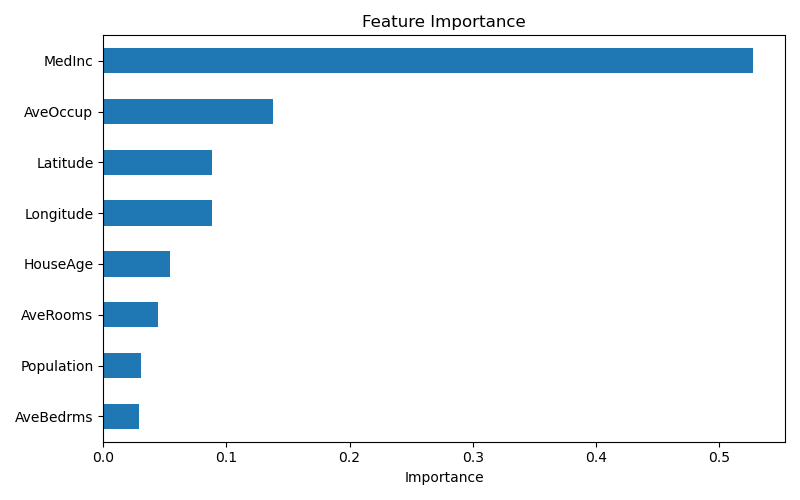
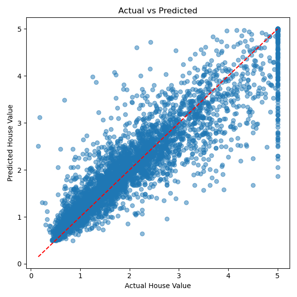

# 实验二 机器学习综合程序设计

## 一、实验目的

1. **理论与实践结合**：通过综合性机器学习项目，加深对机器学习算法、模型训练、评估和优化的理解。
2. **编程能力提升**：掌握使用 Python 及 scikit-learn 等机器学习库实现回归模型的能力。
3. **数据处理能力**：学会处理真实数据集，包括数据预处理、特征工程、数据可视化等。
4. **模型优化与评估**：掌握模型选择、参数调优、性能评估等技能。
5. **创新能力培养**：通过自主设计和实现机器学习项目，培养解决实际问题的创新思维和综合能力。

## 二、实验环境

- **硬件环境**：MacBook Air（Apple M芯片）
- **软件环境**：
  - 操作系统：macOS
  - Python 版本：Python 3.12+
  - 机器学习库：scikit-learn
  - 数据处理库：NumPy、Pandas
  - 数据可视化库：Matplotlib
  - 开发工具：VS Code

## 三、项目概述

### 3.1 项目选题：加州房价预测

本项目选用 **加州房价数据集（California Housing Dataset）**，该数据集包含加州各街区的房价中位数以及多项社会经济和地理特征。任务目标是根据房屋特征（如收入中位数、房屋年龄、房间数量、地理位置等）预测该街区的房价中位数。

**数据来源**：scikit-learn 内置的 `fetch_california_housing` 数据集。

**技术要点**：
- 数据预处理与探索性分析
- 使用随机森林回归模型进行训练和预测
- 特征重要性分析与可视化
- 模型评估（MSE、RMSE、R² 分数）

### 3.2 数据集介绍

加州房价数据集包含 20,640 个样本，每个样本有 8 个特征：

| 特征名 | 说明 | 数据类型 |
|--------|------|----------|
| MedInc | 街区收入中位数 | 连续值 |
| HouseAge | 房屋年龄中位数 | 连续值 |
| AveRooms | 平均房间数 | 连续值 |
| AveBedrms | 平均卧室数 | 连续值 |
| Population | 街区人口 | 连续值 |
| AveOccup | 平均居住人数 | 连续值 |
| Latitude | 纬度 | 连续值 |
| Longitude | 经度 | 连续值 |

目标变量 **MedHouseVal** 为房价中位数（单位：10万美元）。

## 四、数据预处理

由于使用的是 scikit-learn 内置的已清洗数据集，数据预处理主要集中在以下方面：

1. **数据加载与查看**：使用 `fetch_california_housing(as_frame=True)` 加载，自动转为 DataFrame 格式。
2. **数据集分割**：按照 80% 训练集、20% 测试集的比例划分，设置 `random_state=42` 确保结果可重复。
3. **特征规范化处理**：随机森林模型基于决策树，对特征缩放不敏感，因此无需额外的标准化操作。

**数据概览**：

```python
# 合并特征和目标值
df = pd.concat([X, y.rename("MedHouseVal")], axis=1)

print("数据集形状:", df.shape)
# 输出: (20640, 9)
print("特征数量:", X.shape[1])  # 8
print("样本数量:", X.shape[0])  # 20640
print("训练集大小:", X_train.shape)  # (16512, 8)
print("测试集大小:", X_test.shape)   # (4128, 8)
```

## 五、模型选择与训练

### 5.1 算法选型：随机森林回归（Random Forest Regressor）

选择随机森林的原因：
- **集成学习**：集成多棵决策树，降低过拟合风险，提高泛化能力。
- **非线性拟合**：能够捕捉房价与特征之间的复杂非线性关系。
- **特征重要性**：内置特征重要性评估，便于分析各因素对房价的影响。
- **鲁棒性强**：对缺失值和异常值不敏感，适合真实世界数据。

### 5.2 模型参数配置

```python
model = RandomForestRegressor(
    n_estimators=200,      # 决策树数量
    max_depth=20,          # 树的最大深度
    random_state=42,       # 随机种子
    n_jobs=-1              # 使用全部CPU核心加速训练
)
```

**参数说明**：
- `n_estimators=200`：200棵决策树，提供稳定且准确的预测。
- `max_depth=20`：限制决策树深度，防止过拟合。
- `n_jobs=-1`：利用所有可用 CPU 核心并行训练。

### 5.3 训练过程

```python
model.fit(X_train, y_train)
```

训练完成后，模型自动构建了 200 棵决策树，每棵树基于训练数据的 Bootstrap 采样进行学习。

## 六、模型评估与优化

### 6.1 评估指标

| 指标 | 值 | 说明 |
|------|------|------|
| **MSE** | 0.2552 | 均方误差，值越小越好 |
| **RMSE** | 0.5052 | 均方根误差，与目标变量同量纲 |
| **R²** | 0.8053 | 决定系数，表示模型解释了 80.53% 的方差 |

### 6.2 结果分析

- **R² = 0.8053**：模型能够解释测试集上约 80.5% 的房价变化，说明模型具有较好的预测能力。
- **RMSE = 0.5052**：平均预测误差约为 50,520 美元（目标变量单位为10万美元），在合理范围内。
- 随机森林模型在加州房价预测任务上表现良好，但仍有进一步优化空间。

### 6.3 优化方向

- **超参数调优**：使用 GridSearchCV 或 RandomizedSearchCV 系统搜索最佳参数组合。
- **特征工程**：尝试构造新特征（如人口密度、房间与卧室比例等）。
- **集成多种模型**：尝试 XGBoost、LightGBM 等梯度提升模型，或进行模型融合。

## 七、结果可视化

### 7.1 特征重要性分析



特征重要性排名：
1. **MedInc（收入中位数）**：最重要的特征，对房价预测贡献最大。
2. **AveOccup（平均居住人数）**：次要特征。
3. **Latitude/Longitude（地理位置）**：地理位置对房价有显著影响。
4. 其余特征（HouseAge、AveRooms、AveBedrms、Population）贡献相对较小。

**分析**：收入水平是房价的最强预测因子，这符合经济学常识。地理位置的重要性反映了加州不同区域的房价差异。

### 7.2 真实值 vs 预测值散点图



从散点图可以看出：
- 数据点大致分布在对角线附近，说明预测值与真实值趋势一致。
- 低房价区域（<2）的预测较为准确，点分布集中在对角线附近。
- 高房价区域（>5）的预测偏差较大，说明模型对极端值的预测能力有限。
- 红色对角线表示完美预测线，点越靠近对角线说明预测越准确。

## 八、项目总结

### 8.1 主要成果

1. 成功使用加州房价数据集构建了随机森林回归模型。
2. 模型在测试集上取得了 R² = 0.8053 的良好表现。
3. 通过特征重要性分析，确认了收入中位数和地理位置是影响房价的关键因素。
4. 完成了完整的机器学习工作流：数据加载、划分训练测试集、模型训练、评估、可视化和结果保存。

### 8.2 遇到的问题及解决方案

| 问题 | 解决方案 |
|------|----------|
| 数据理解不够充分 | 打印前几行数据和基本统计信息进行探索性分析 |
| 模型参数选择缺乏依据 | 参考 scikit-learn 文档和最佳实践，先从保守参数起步 |
| 特征重要性排序不直观 | 使用 Pandas Series 排序并以横向柱状图展示 |

### 8.3 收获与体会

通过本次机器学习项目，我深刻体会到：

1. **数据理解是基础**：在建模之前充分理解数据分布和特征含义至关重要。
2. **模型选择需权衡**：随机森林在准确性和可解释性之间取得了良好平衡，适合回归预测任务。
3. **特征工程提升巨大**：最重要的特征贡献远超次要特征，好的特征工程甚至比模型选择更重要。
4. **评估指标需综合考量**：单一指标不足以全面评价模型，应结合多个指标分析。

### 8.4 改进建议

- 尝试 XGBoost、LightGBM 等更先进的梯度提升模型，可能进一步提升预测精度。
- 引入外部数据（如学区信息、犯罪率、交通便利度等）丰富特征空间。
- 对极端房价区域进行专门分析和建模，提高整体预测效果。
- 使用交叉验证确保模型稳定性和泛化能力。
