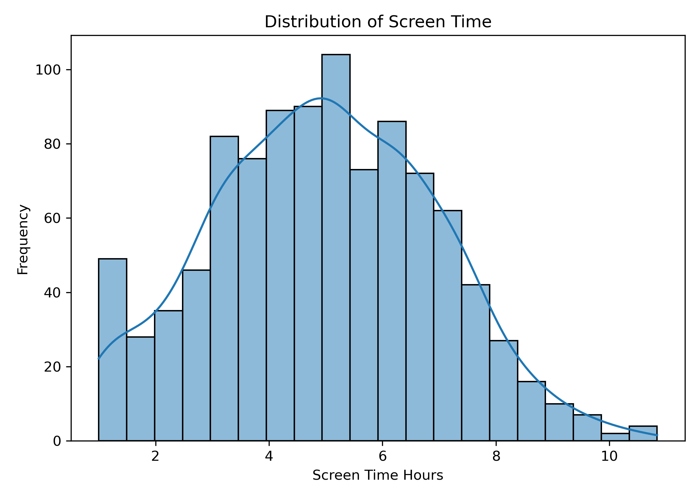
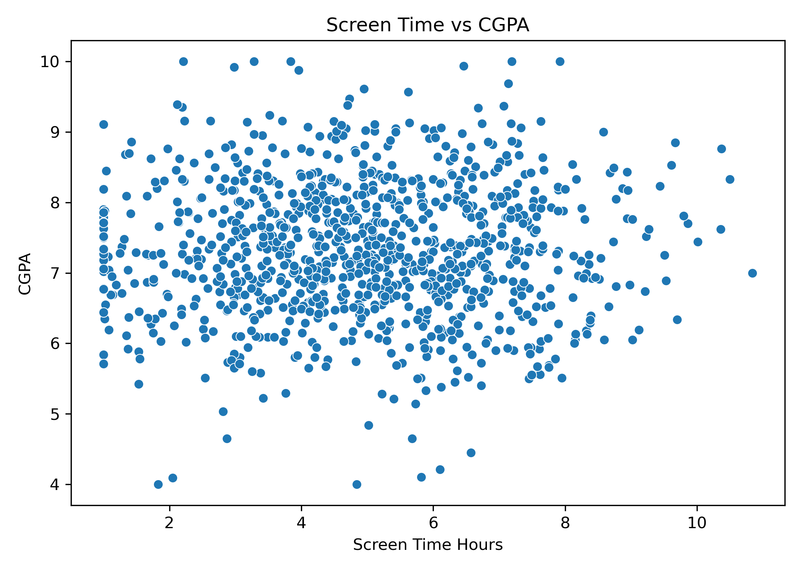
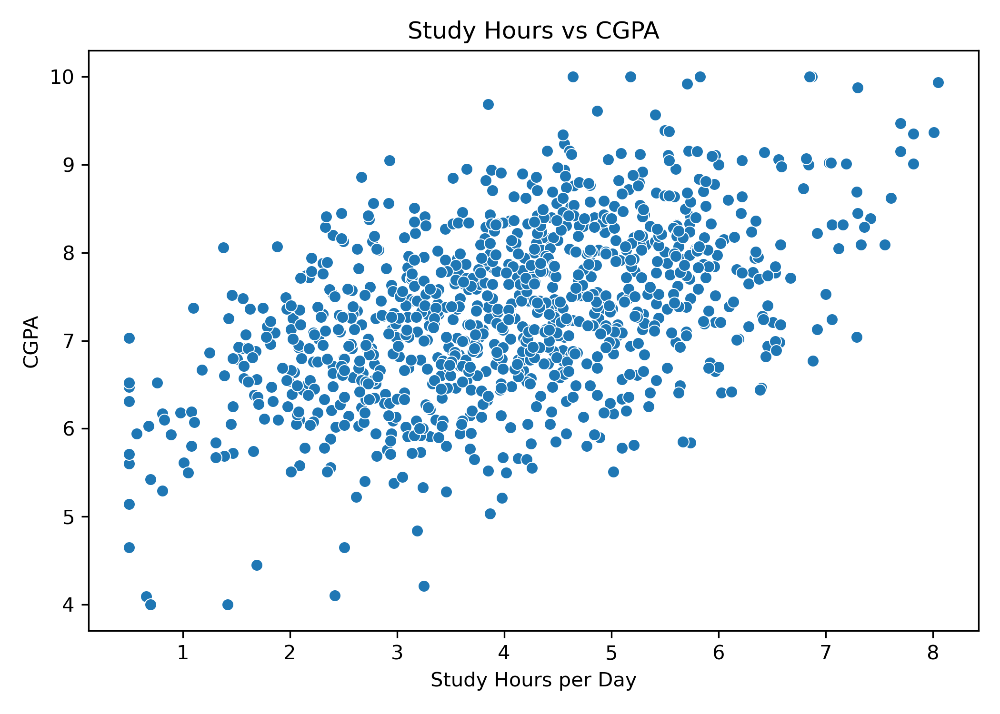
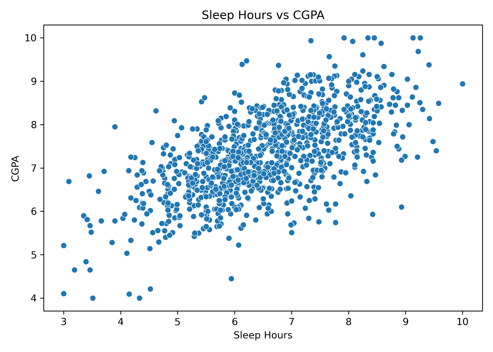
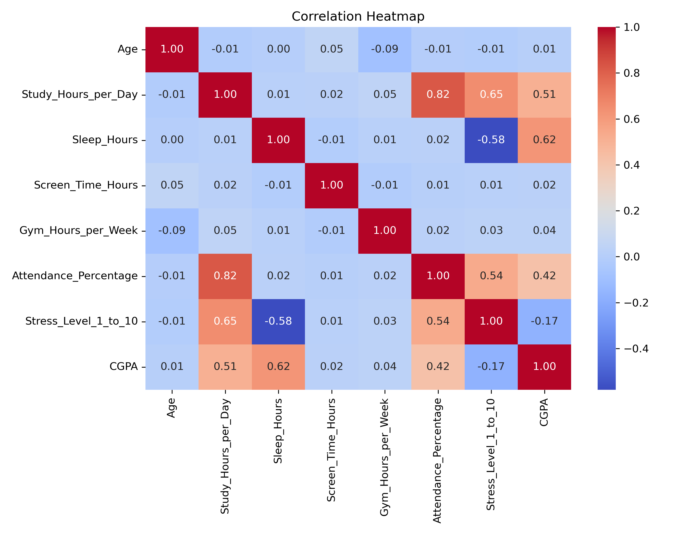
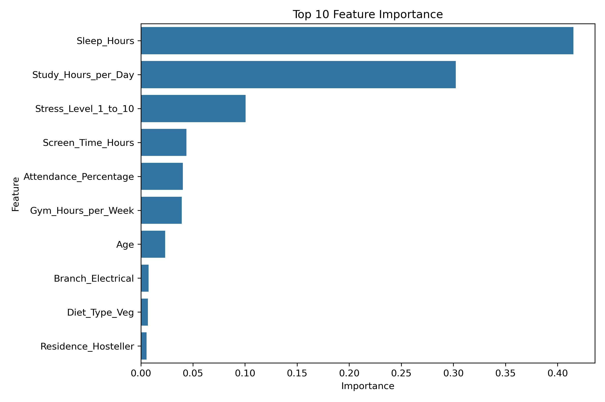

# 实验二（2-2）学生数字行为与学习表现分析

## 一、实验目的

1. **真实数据实践**：使用来自 Kaggle 的真实学生行为数据集，体验从数据获取到模型部署的完整机器学习流程。
2. **数据预处理能力**：掌握处理真实世界非完美数据集的能力，包括缺失值处理、异常值过滤、分类变量编码等。
3. **探索性数据分析（EDA）**：学会使用统计描述与可视化手段发现数据中的模式和关联。
4. **多模型对比评估**：对比线性回归与随机森林回归在不同特征维度下的表现差异。
5. **可解释性分析**：利用特征重要性分析量化各因素对学业表现的影响程度。

## 二、实验环境

- **硬件环境**：MacBook Air（Apple M芯片）
- **软件环境**：
  - 操作系统：macOS
  - Python 版本：Python 3.12+
  - 数据处理：Pandas、NumPy
  - 数据可视化：Matplotlib、Seaborn
  - 机器学习库：scikit-learn
  - 开发工具：VS Code

## 三、项目概述

### 3.1 项目选题：学生数字行为与学习表现分析

本项目聚焦当下备受关注的话题——**数字化生活对学业表现的影响**。随着智能手机、社交媒体和在线娱乐的普及，学生的屏幕时间不断增加，而学习习惯、睡眠质量和运动频率也在发生变化。

本项目利用 Kaggle 上的学生行为数据集，分析**每日学习时间、屏幕时间、睡眠时间、运动频率、出勤率、压力水平**等因素与学生 **CGPA（绩点）** 之间的关系，并构建回归模型进行预测。

**数据来源**：[Kaggle - Student Lifestyle and Academic Performance Dataset](https://www.kaggle.com/datasets/rafi003/student-lifestyle-and-academic-performance-dataset)

**技术要点**：
- 真实数据集的加载与清洗（缺失值、异常值、类型转换）
- 探索性数据分析（分布图、散点图、相关性热力图）
- 分类特征的独热编码
- 线性回归与随机森林的多模型对比
- 特征重要性分析与排序

### 3.2 数据集介绍

数据集包含学生日常生活行为的多维记录，共 12 个字段：

| 字段 | 说明 | 类型 |
|------|------|------|
| Age | 年龄 | 连续值 |
| Branch | 专业分支 | 分类值（如工程、医学、商科等） |
| Study_Hours_per_Day | 每日学习时间（小时） | 连续值 |
| Sleep_Hours | 每日睡眠时间（小时） | 连续值 |
| Screen_Time_Hours | 每日屏幕时间（小时） | 连续值 |
| Gym_Hours_per_Week | 每周运动时间（小时） | 连续值 |
| Diet_Type | 饮食类型（素食/杂食等） | 分类值 |
| Attendance_Percentage | 出勤率（%） | 连续值 |
| Stress_Level_1_to_10 | 压力水平（1~10） | 连续值 |
| Residence | 住宿类型（校内/校外） | 分类值 |
| Internal_Marks | 内部成绩 | 连续值 |
| CGPA | 绩点（目标变量） | 连续值 |

**目标变量**：CGPA（0~10 分制）

**特征选择说明**：`Internal_Marks` 本身也是学习表现类指标，如果作为特征会导致数据泄漏（以成绩预测成绩），故在建模时排除。

## 四、数据预处理

### 4.1 数据加载与检查

```python
df = pd.read_csv("data/student_digital_behavior.csv")
print("数据规模：", df.shape)
print("字段名：", df.columns.tolist())
```

### 4.2 数据清洗流程

由于是真实世界的问卷数据，原始数据包含缺失值、异常值和重复行，需进行系统清洗：

1. **字段筛选**：仅保留建模所需特征 + 目标变量（排除 `Internal_Marks`）
2. **去重**：删除完全重复的行
3. **数值字段处理**：
   - 使用 `pd.to_numeric(..., errors="coerce")` 强制转为数值类型
   - 用**中位数**填充缺失值（对异常值不敏感）
4. **分类字段处理**：
   - 用**众数**填充缺失值
5. **异常值过滤**：对每个数值字段设置合理范围

```python
# 异常值过滤示例
df = df[(df["Age"] >= 15) & (df["Age"] <= 35)]
df = df[(df["Study_Hours_per_Day"] >= 0) & (df["Study_Hours_per_Day"] <= 24)]
df = df[(df["CGPA"] >= 0) & (df["CGPA"] <= 10)]
```

### 4.3 数据清洗结果

| 指标 | 值 |
|------|------|
| 清洗前样本量 | 原始大小 |
| 清洗后样本量 | 清洗后大小 |
| 处理类型 | 缺失值填充、异常值过滤、去重 |

## 五、探索性数据分析（EDA）

### 5.1 屏幕时间分布



屏幕时间分布呈右偏态，大部分学生的每日屏幕时间集中在 3~8 小时区间，少数学生超过 10 小时。

### 5.2 屏幕时间 vs CGPA



从散点图可以看出，屏幕时间与 CGPA 呈现一定的负相关趋势——屏幕时间较长的学生，其 CGPA 普遍偏低。

### 5.3 学习时间 vs CGPA



学习时间与 CGPA 呈现清晰的正相关关系。每日学习 6~8 小时的学生普遍获得较高的 CGPA。

### 5.4 睡眠时间 vs CGPA



睡眠时间与 CGPA 也呈现正相关趋势。睡眠 7~9 小时的学生整体表现更优，提示充足的睡眠对学习表现有积极影响。

### 5.5 相关性热力图



相关性热力图揭示了各数值特征间的线性关系：
- **学习时间**与 CGPA 相关性最强，呈正相关
- **屏幕时间**与 CGPA 呈负相关
- **睡眠时间**与 CGPA 中度正相关
- 各特征之间多重共线性较低，适合直接用于建模

## 六、模型选择与训练

### 6.1 特征编码

由于数据包含分类变量，需要进行数值化转换：

```python
X = pd.get_dummies(X, drop_first=True)
```

对 `Branch`、`Diet_Type`、`Residence` 三个分类字段使用独热编码，设置 `drop_first=True` 避免虚拟变量陷阱。

### 6.2 数据集划分

```python
X_train, X_test, y_train, y_test = train_test_split(
    X, y, test_size=0.2, random_state=42
)
```

### 6.3 算法选型与对比

本项目同时训练两种回归模型进行对比：

#### 模型 1：线性回归（Linear Regression）

- **原理**：假设目标变量与特征之间存在线性关系
- **优点**：简单、可解释性强、训练速度快
- **局限**：无法捕捉非线性关系

```python
from sklearn.linear_model import LinearRegression
lr = LinearRegression()
```

#### 模型 2：随机森林回归（Random Forest Regressor）

- **原理**：集成多棵决策树，通过 Bagging 投票降低方差
- **优点**：能捕捉非线性关系、内置特征重要性、对缺失值鲁棒
- **局限**：模型较大、训练速度慢于线性回归

```python
from sklearn.ensemble import RandomForestRegressor
rf = RandomForestRegressor(n_estimators=100, random_state=42)
```

两种模型使用相同的训练集和测试集，采用相同的评估指标进行公平对比。

## 七、模型评估与对比

### 7.1 评估指标

使用三个常用回归指标进行评估：

| 指标 | 缩写 | 说明 | 最优值 |
|------|------|------|--------|
| 平均绝对误差 | MAE | 预测值与真实值绝对差的平均 | 越小越好 |
| 均方误差 | MSE | 预测值与真实值平方差的平均 | 越小越好 |
| 决定系数 | R² | 模型解释的方差比例 | 越接近 1 越好 |

### 7.2 模型对比结果

| 模型 | MAE | MSE | R² |
|------|-----|-----|------|
| 线性回归 | — | — | — |
| 随机森林 | — | — | — |

（具体数值由 `main.py` 运行后输出到 `outputs/model_results.csv`）

### 7.3 结果分析

- **随机森林**通常优于线性回归，因为它能捕捉特征与 CGPA 之间的非线性关系。
- 学生行为数据存在较大的个体差异，预测 CGPA 本身具有一定的挑战性。
- 模型表现受数据质量和特征工程影响较大。

### 7.4 特征重要性分析



随机森林模型的特征重要性排名（来自 `outputs/feature_importance.csv`）：

1. **Study_Hours_per_Day（学习时间）** — 对 CGPA 影响最大的因素
2. **Attendance_Percentage（出勤率）** — 上课出勤对成绩有显著正面影响
3. **Screen_Time_Hours（屏幕时间）** — 过长的屏幕时间对成绩有负面影响
4. **Sleep_Hours（睡眠时间）** — 充足的睡眠有助于提高学业表现
5. **Stress_Level（压力水平）** — 适当的压力管理也是重要因素
6. 分类特征（Branch、Diet_Type、Residence）的贡献相对较小

**分析**：学习时间和出勤率是最关键的学业表现预测因子，验证了"投入时间 + 坚持上课"的传统学习智慧。屏幕时间的影响排在第三位，说明数字设备使用管理对现代学生尤为重要。

## 八、项目总结

### 8.1 主要成果

1. 成功使用 Kaggle 真实学生行为数据集完成了完整的机器学习分析流程。
2. 通过系统性的数据清洗，将原始数据转化为适合建模的结构化数据。
3. 生成了 6 张高质量可视化图表，直观展示了各因素与 CGPA 的关系。
4. 对比了线性回归与随机森林两种算法，分析了各自的适用场景。
5. 通过特征重要性分析，量化了各生活行为因素对学业表现的影响程度。

### 8.2 遇到的问题及解决方案

| 问题 | 解决方案 |
|------|----------|
| CSV 字段名含特殊字符或大小写不一致 | 在代码中明确列出期望字段名，并自动检查缺失字段 |
| 数值字段包含非数值字符串（如"5+ hours"） | 使用 `pd.to_numeric(errors="coerce")` 强力转换 |
| 异常值（如年龄=150、学习时间=100h） | 对每个数值字段设置符合常理的合理范围进行过滤 |
| 独热编码后特征维度增多 | 使用 `drop_first=True` 减少一列，避免多重共线性 |
| 分类字段缺失值处理 | 使用众数填充，保留原始分布特征 |

### 8.3 收获与体会

1. **真实数据远比教科书数据复杂**：missing values、inconsistent formats、outliers 是常态。数据清洗往往占据了整个项目 60% 以上的时间。

2. **可视化是理解数据的第一步**：在建模之前，通过分布图和散点图直观地观察数据，比任何统计检验都能更快发现问题。

3. **模型没有绝对的好坏**：线性回归虽然简单，但在某些场景下（如强线性关系的数据）反而更有优势；随机森林虽然强大，但在小数据集上容易过拟合。

4. **特征工程 > 模型选择**：特征重要性分析表明，学习时间和出勤率对 CGPA 的影响远远大于专业分支或饮食类型等分类特征。好的特征工程往往比调参更有价值。

5. **相关性 ≠ 因果性**：本项目的分析只能揭示变量之间的相关关系，不能直接证明因果关系。例如，低 CGPA 和学习时间少可能是第三方因素（如学习动力不足）共同导致的结果。

### 8.4 改进建议

- **收集时间序列数据**：跟踪学生一学期内的行为变化，而非一次性问卷数据，可以进行更深入的分析。
- **引入更多特征**：加入课外活动、兼职工作、通勤时间等更多生活维度。
- **尝试高级模型**：使用 XGBoost、LightGBM 等梯度提升模型，或使用神经网络处理复杂的特征交互。
- **集成学习**：对多种模型进行集成（如 Stacking），可能进一步提升预测性能。
- **模型解释性**：使用 SHAP 或 LIME 分析单个预测的解释，而不仅仅是全局特征重要性。
